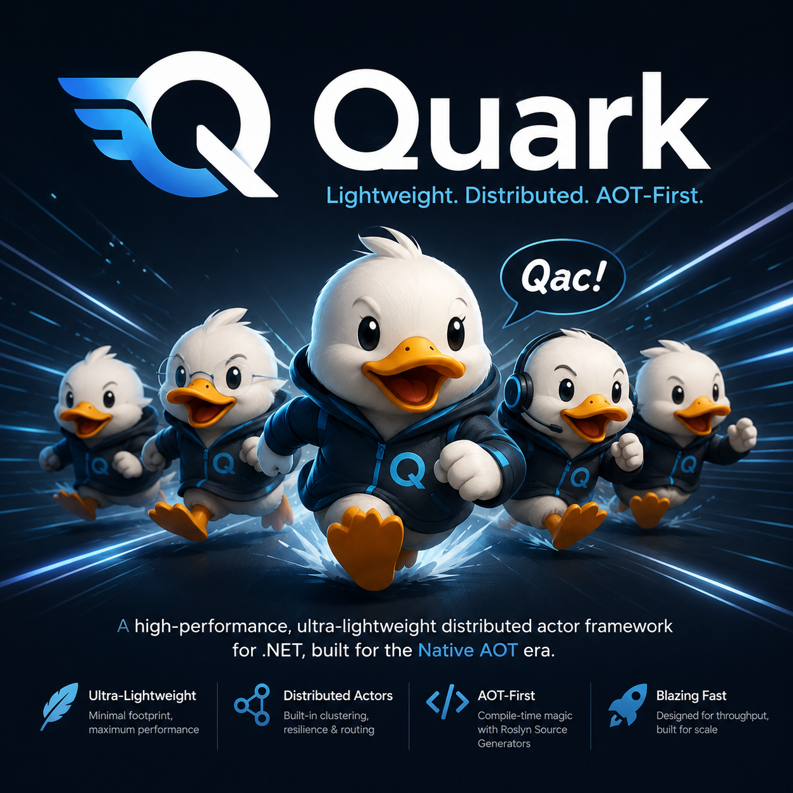

<p align="center">
  
</p>

# Quark

**Native AOT-first, Orleans-compatible distributed actor framework for .NET 10.**

Quark follows the Orleans mental model — Grain, Silo, Client, Placement, Persistence — while being built from the ground up for AOT compilation, per-call DI scoping, and lean memory footprints. It achieves Orleans API compatibility at three tiers: drop-in (identical attributes and interfaces), minor-change (same concept, different DI wiring), and Quark-native (new capabilities without direct Orleans equivalents).

## Why Quark?

Quark is built as an engine, not a collection of actor-shaped conventions. The runtime owns activation identity, mailbox ordering, placement, state lifetime, timers, resource cleanup, persistence boundaries, and diagnostics. User code supplies behavior through explicit APIs that the engine can schedule, observe, persist, and validate.

That leads to a deliberately strong model:

- **Behavior is execution logic, not grain state.** Grain behaviors are POCOs resolved from a fresh `IServiceScope` for each call, invoked, then discarded.
- **State must be visible to the engine.** Cross-call state belongs in `IActivationMemory<T>`, `IPersistentActivationMemory<T>`, `IPersistentState<T>`, `IManagedActivationMemory<T>`, journals, or explicit external services.
- **AOT is a design constraint, not an optimization.** Quark favors source generation, explicit registration, and analyzers over runtime discovery and reflection-heavy magic.
- **Compatibility is a bridge.** Orleans-style APIs help teams adopt Quark, but the core runtime remains Quark-native: activation-shell owned, generated, trim-safe, and lifecycle-driven.

In short: Orleans-compatible at the edge, Quark-engineered at the core.

Two wiki pages make this case in depth — and honestly:

- **[Why Quark](../../wiki/Why-Quark)** — positioning vs Orleans and Akka.NET, the AOT trade-offs, per-call construction costs, and when you should *not* choose Quark.
- **[Lifecycle and Failure Semantics](../../wiki/Lifecycle-and-Failure-Semantics)** — the engine contract: what lives how long, and exactly what happens when a behavior throws, an activation fails, a timer faults, or a transaction half-commits.

**Project status: pre-1.0.** The failure, delivery, and performance contracts are documented and being hardened in the open — see the roadmap epics: [Track A — security](https://github.com/thnak/Quark/issues/50), [Track B — reliability](https://github.com/thnak/Quark/issues/51), [Track C — benchmarks](https://github.com/thnak/Quark/issues/52), [Track D — CI/process](https://github.com/thnak/Quark/issues/53), and the [v1.0 engine epic](https://github.com/thnak/Quark/issues/128). If you need years of production burn-in today, Orleans remains the honest recommendation; choose Quark when Native AOT deployment and an explicit, analyzable engine contract are what you're optimizing for.

## Features

- Virtual actor model with grain behaviors (POCO, no base class required)
- Per-call DI scoping — fresh `IServiceScope` per grain method call
- `IActivationMemory<T>` and `IPersistentActivationMemory<T>` for in-memory and durable state
- `[PersistentState]` attribute injection (Orleans-compatible)
- `JournaledGrain<TState,TEvent>` event sourcing
- Durable grain reminders (in-memory + Redis backends)
- In-memory grain timers with mailbox-safe callbacks
- In-memory streams (`IAsyncStream<T>`) with implicit subscriptions
- TCP gateway client with server-pushed stream delivery
- Multi-silo clustering with distributed grain directory
- TLS transport (mutual TLS supported)
- ACID transactions with 2PC coordinator (`ITransactionalState<T>`)
- Grain observers (`IGrainObserver` + `CreateObjectReference<T>`)
- Idle-timeout grain collector
- OpenTelemetry activity propagation
- Native AOT + trim-safe throughout — zero reflection on hot paths
- Roslyn source generators: `GrainProxyGenerator`, `BehaviorRegistrationGenerator`, `SerializerGenerator`
- AOT-safety analyzers (QRK0001–QRK0003)

## Quick start

```csharp
// 1. Define a grain interface (shared project)
public interface ICounterGrain : IGrainWithStringKey
{
    Task IncrementAsync();
    Task<int> GetAsync();
}

// 2. Write a grain behavior (server project)
public sealed class CounterState { public int Count { get; set; } }

public sealed class CounterBehavior : IGrainBehavior, ICounterGrain
{
    private readonly IActivationMemory<CounterState> _memory;
    public CounterBehavior(IActivationMemory<CounterState> memory) => _memory = memory;
    public Task IncrementAsync() { _memory.Value.Count++; return Task.CompletedTask; }
    public Task<int> GetAsync()  => Task.FromResult(_memory.Value.Count);
}

// 3. Host and call
var host = Host.CreateDefaultBuilder(args)
    .UseQuark(silo =>
    {
        silo.Services.AddQuarkRuntime();
        silo.Services.AddTcpTransport();
        silo.UseLocalhostClustering(gatewayPort: 30001);
        silo.Services.AddMyAssemblyBehaviors(); // BehaviorRegistrationGenerator
    })
    .UseQuarkClient(client =>
    {
        client.Services.AddLocalClusterClient();
        client.Services.AddGrainProxy<ICounterGrain, CounterGrainProxy>(); // GrainProxyGenerator
    })
    .Build();

var factory = host.Services.GetRequiredService<IGrainFactory>();
var counter = factory.GetGrain<ICounterGrain>("my-counter");
await counter.IncrementAsync();
Console.WriteLine(await counter.GetAsync()); // 1
```

## Build

```bash
# Build entire solution
dotnet build Quark.slnx

# Run all tests
dotnet test Quark.slnx

# Native AOT smoke build (Linux)
dotnet publish src/Quark.Runtime/Quark.Runtime.csproj -f net10.0 -c Release -r linux-x64 /p:PublishAot=true
```

.NET SDK is pinned to `10.0.201` via `global.json`. Package versions are centrally managed in `Directory.Packages.props` — do not add `Version=` attributes to individual `<PackageReference>` elements.

## Package layout

| Package | Role |
|---|---|
| `Quark.Core.Abstractions` | `IGrain`, key interfaces, `IGrainFactory`, `IClusterClient`, lifecycle, placement |
| `Quark.Core` | Host-builder extensions (`UseQuark`, `UseQuarkClient`) |
| `Quark.Server` | Server meta-package — pulls in `Quark.Runtime` + `Quark.Core` for hosting silos |
| `Quark.Runtime` | Silo runtime: activations, invoker, placement, message pump |
| `Quark.Client` | `LocalClusterClient`, proxy factory registries |
| `Quark.Client.Tcp` | `TcpGatewayClusterClient`, TCP stream push |
| `Quark.Serialization` | Binary codec runtime (ZigZag + LEB128) |
| `Quark.Transport.Tcp` | TCP transport with TLS (System.IO.Pipelines) |
| `Quark.Persistence.*` | `IGrainStorage`, `IPersistentActivationMemory`, `JournaledGrain`, InMemory + Redis providers |
| `Quark.Reminders.*` | Durable reminders, InMemory + Redis storage |
| `Quark.Streaming.*` | `IAsyncStream<T>`, in-memory stream provider |
| `Quark.Transactions` | `ITransactionalState<T>`, 2PC coordinator |
| `Quark.CodeGenerator` | Roslyn source generators |
| `Quark.Analyzers` | Roslyn analyzers: AOT safety (`QRK000x`), data isolation (`QRK001x`), behavior lifecycle (`QRK002x`), performance (`QRK003x`) |
| `Quark.Diagnostics.*` | `IQuarkDiagnosticListener` event surface, OpenTelemetry instruments, `StuckGrainDetector` |
| `Quark.Testing` | In-process `TestCluster` test harness |

## Samples

| Sample | Demonstrates |
|---|---|
| `samples/Adventure` | Grain-to-grain calls, timers, TCP gateway client, multi-grain state |
| `samples/ChatRoom` | In-memory streams, TCP client stream push, observers, Spectre.Console UI |
| `samples/Streaming` | In-memory + TCP stream push, implicit subscriptions |
| `samples/Persistence` | The "Bank" sample — all five state patterns side by side (`IPersistentActivationMemory`, `[PersistentState]`, `JournaledGrain`, eager + managed memory) |
| `samples/Realm` | MMO spatial backbone — placement, timers, streams at scale |

See the [Samples wiki page](../../wiki/Samples) for full walkthroughs.

## Documentation

Full documentation is in the [wiki](../../wiki):

- [Why Quark](../../wiki/Why-Quark)
- [Architecture](../../wiki/Architecture)
- [Lifecycle and Failure Semantics](../../wiki/Lifecycle-and-Failure-Semantics)
- [Writing Grains](../../wiki/Writing-Grains)
- [Persistence](../../wiki/Persistence)
- [Serialization](../../wiki/Serialization)
- [Streaming](../../wiki/Streaming)
- [Timers and Reminders](../../wiki/Timers-and-Reminders)
- [Transactions](../../wiki/Transactions)
- [Clustering and Transport](../../wiki/Clustering-and-Transport)
- [Source Generators](../../wiki/Source-Generators)
- [Testing](../../wiki/Testing)
- [AOT and Trim](../../wiki/AOT-and-Trim)
- [Orleans Migration Guide](../../wiki/Orleans-Migration)

## Design principles

1. **AOT-first.** No reflection on hot paths. Source generators emit all proxy, serializer, and registration code at build time.
2. **Engine-owned lifecycle.** The activation shell owns identity, ordering, state lifetime, timers, resources, placement, and deactivation.
3. **Per-call DI scoping.** Each grain method call gets a fresh `IServiceScope`, enabling scoped services (DbContext, etc.) without manual workarounds.
4. **Fail fast.** `BehaviorStartupValidator` catches DI misconfiguration at silo startup, not on the first live call.
5. **Explicit registration.** No assembly scanning. Every type is registered via explicit extension methods.
6. **Mailbox unchanged.** The `Channel<Func<Task>>` single-reader queue is the actor model's correctness guarantee.
