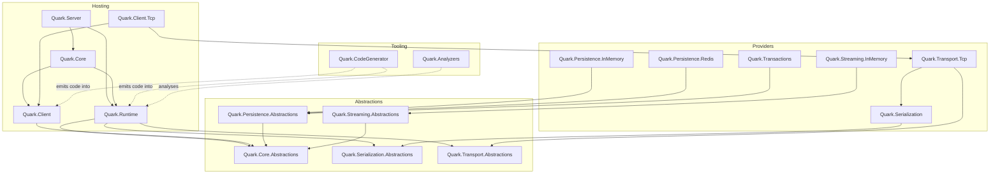
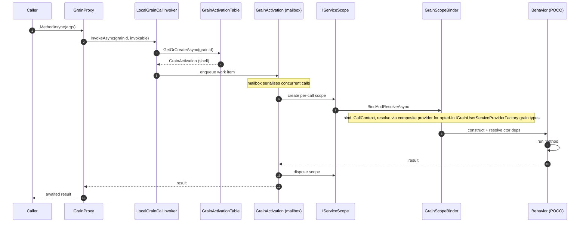
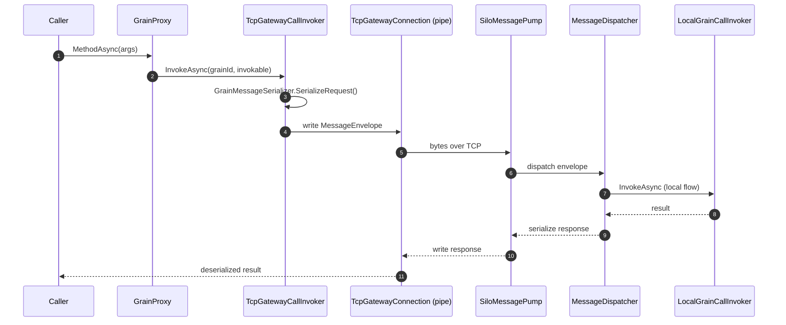
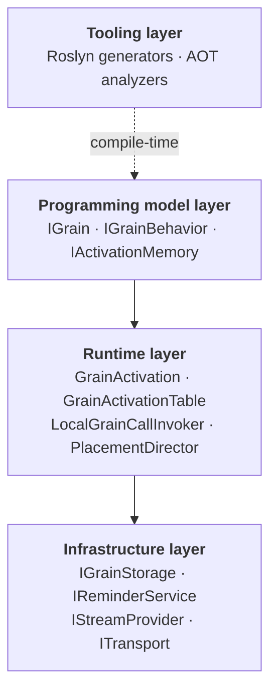

# Architecture

## Package layout

| Package | Role |
|---|---|
| `Quark.Core.Abstractions` | `GrainId`, `GrainType`, `IGrain`, key-typed grain interfaces, `IGrainFactory`, `IClusterClient`, `IGrainContext`, lifecycle, placement attributes |
| `Quark.Serialization.Abstractions` | `IFieldCodec<T>`, `IDeepCopier<T>`, `CodecWriter`/`CodecReader`, `[GenerateSerializer]`/`[Id]`/`[Alias]` |
| `Quark.Transport.Abstractions` | `ITransport`, `ITransportListener`, `ITransportConnection` (IDuplexPipe), `MessageEnvelope` |
| `Quark.Core` | `ISiloBuilder`, `IClientBuilder`, `UseQuark()`/`UseQuarkClient()` host-builder extensions |
| `Quark.Runtime` | Silo-side runtime: `GrainActivation`, `GrainActivationTable`, `LocalGrainCallInvoker`, `SiloHostedService`, message pump/dispatcher, placement |
| `Quark.Client` | `LocalClusterClient`, `LocalGrainFactory`, proxy/observer factory registries |
| `Quark.Client.Tcp` | `TcpGatewayClusterClient`, `TcpGatewayGrainFactory`, client-side stream push |
| `Quark.Serialization` | 18 primitive codecs, `CodecProvider`, `QuarkSerializer`, serialization DI |
| `Quark.Transport.Tcp` | `TcpTransport`/`TcpTransportListener`/`TcpTransportConnection` (System.IO.Pipelines), TLS |
| `Quark.Persistence.Abstractions` | `IGrainStorage`, `IPersistentActivationMemory<T>`, `IStorage<T>`, `GrainState<T>`, `JournaledGrain<TState,TEvent>` |
| `Quark.Persistence.InMemory` | In-memory `IGrainStorage` provider |
| `Quark.Persistence.Redis` | Redis-backed `IGrainStorage` (StackExchange.Redis) |
| `Quark.Reminders.Abstractions` | `IRemindable`, `IReminderService`, `IGrainReminder`, `DefaultReminderService` |
| `Quark.Reminders.InMemory` | In-process reminder store |
| `Quark.Reminders.Redis` | Redis-backed reminder store |
| `Quark.Streaming.Abstractions` | `IAsyncStream<T>`, `IAsyncObserver<T>`, `StreamId`, `[ImplicitStreamSubscription]` |
| `Quark.Streaming.InMemory` | In-memory stream provider |
| `Quark.Transactions` | `ITransactionalState<T>`, `[Transaction]`, 2PC coordinator |
| `Quark.CodeGenerator` | Roslyn incremental generators: `GrainProxyGenerator`, `BehaviorRegistrationGenerator`, `SerializerGenerator` |
| `Quark.Analyzers` | AOT-safety Roslyn analyzers (QRK0001–QRK0003) |
| `Quark.Testing` | `TestCluster`/`TestSilo`/`TestClient` in-process test harness |

## Package dependency graph

How the packages layer on top of each other. Arrows point from a package to what it depends on;
abstractions sit at the bottom, providers and tooling on top.



## Engine model (M2)

Quark's M2 milestone moved from the Orleans **Framework model** (inheriting `Grain`) to the **Engine model** (implementing `IGrainBehavior`).

| | Framework model | Engine model |
|---|---|---|
| Developer writes | `class MyGrain : Grain` | `class MyBehavior : IGrainBehavior` |
| Lifecycle owner | Developer (inherits base class) | Engine (controls scope and scheduling) |
| DI scope | Root — leaks scoped services | Per-call — fresh `IServiceScope` each call |
| In-memory state | Field on the long-lived grain | `IActivationMemory<TState>` — lives in shell |
| Persistent state | `Grain<TState>` base class | `IPersistentActivationMemory<TState>` |
| RAM footprint | Full grain object tree per activation | Lightweight shell; behavior objects exist for milliseconds |
| Startup safety | Fails at first live call | `BehaviorStartupValidator` fails silo at startup |

### Key concepts

**Shell** (`GrainActivation`) — the long-lived object that owns the mailbox (`Channel<Func<Task>>`). It holds the `GrainId`, root `IServiceProvider`, and `StateHolder<TState>` bags for activation memory. One shell per live grain identity on this silo.

**Behavior** — a POCO class implementing `IGrainBehavior`. Constructed per call inside a short-lived `IServiceScope`, executes, then discarded. All constructor parameters are resolved from that scope.

**Activation memory** — a `StateHolder<TState>` owned by the shell. Survives across calls on the same activation; lost on deactivation. Exposed to the behavior via `IActivationMemory<TState>`.

**The core contract:** behavior code is execution logic; the activation shell owns identity,
ordering, state lifetime, timers, disposal, and placement. A behavior instance never outlives the
call that created it, so anything it needs to remember must be handed to the shell — there is no
"the actor" to keep it in, only "the current call." See [Writing Grains](Writing-Grains#the-one-rule-behavior-fields-are-per-call)
for what that means in practice and how it contrasts with long-lived actor-object frameworks.

The shell is the only long-lived object; behaviors are transient. One shell can serve many behavior
instances over its lifetime — one per call:


## Local call flow

A single in-process call, from the client proxy down to the behavior and back. The mailbox is what
serialises concurrent calls to the same activation (unless the method is `[Reentrant]`).



## Remote (TCP gateway) call flow

A call from a silo-less client. The request is serialised, crosses the TCP gateway, and re-enters
the **same local flow** on the silo side. See [Clustering and Transport](Clustering-and-Transport)
for the transport-level detail.



## DI registration pattern

Grains, behaviors, proxies, and transport dispatchers use explicit registration. Nothing is discovered via assembly scanning (trim-unsafe). A typical silo registers:

```csharp
silo.Services.AddGrainBehavior<IMyGrain, MyBehavior>();
silo.Services.AddGrainTransportDispatcher(new GrainType("MyGrain"), new MyGrainProxy_TransportDispatcher());
silo.Services.AddScoped<IActivationMemory<MyState>>(sp =>
    new ActivationMemoryAccessor<MyState>(
        sp.GetRequiredService<IActivationShellAccessor>().Shell.GetOrCreateHolder<MyState>()));
```

The `BehaviorRegistrationGenerator` eliminates this boilerplate — see [Source Generators](Source-Generators).

## Quark-owned services vs. user services

Every constructor parameter a behavior asks for comes out of a DI container, but it falls into one of
two categories:

| | Quark-owned services | User services |
|---|---|---|
| Registered by | The runtime — `AddManagedActivationMemory<T>`, `AddEagerActivationMemory<T>`, and the `BehaviorRegistrationGenerator`'s per-behavior accessor registrations all funnel through `AddQuarkOwnedScoped<T>` | The developer — ordinary `silo.Services.AddScoped/AddSingleton/AddTransient<T>()` |
| Examples | `IActivationShellAccessor`, `ICallContext`/`ICallContextSetter`, `IBehaviorResolver`, `IActivationMemory<T>`, `IManagedActivationMemory<T>`, `IEagerActivationMemory<T>`, `IPersistentActivationMemory<T>` | Repositories, HTTP clients, domain/business services — anything a behavior's constructor needs that isn't a Quark abstraction |
| Lifetime Quark guarantees | Fresh every call (or scoped to the activation, for shell-backed state) | Whatever the developer registered it as |

**By default the two categories are not actually separated at resolution time.** Both are registered on
the same `silo.Services` `IServiceCollection` and resolved from the same flat `IServiceScope`, created
fresh for every grain call (see "Local call flow" above). A behavior's constructor has no way to tell
which category a given parameter belongs to, and doesn't need to — they're just registrations in one
container. Reusing a single flat per-call scope for both is what keeps every service, Quark's and the
developer's alike, provably per-call. That's the actual point of the engine model: it's the mechanism
that rules out the "a grain leaks a scoped `DbContext` across its lifetime" class of bug the Framework
model was prone to (see the Framework-vs-Engine table above).

The two categories only become **visibly separate** — living in two different containers instead of
one — when a behavior opts into `IGrainUserServiceProviderFactory` below, trading the "everything
re-resolved per call" default for a long-lived, per-grain-type-cached provider for its *own* services.
Making that trade safely, so a cached user registration can never accidentally shadow a Quark-owned
type, is why that mechanism needs a second "Quark-only" satellite container and a
`CompositeServiceProvider` to recombine the two — machinery that doesn't exist, and isn't needed, on
the default path.

## Opt-in user-service-provider factory (per-grain-type cached DI)

`IGrainUserServiceProviderFactory` is an opt-in mechanism, declared directly on the behavior class,
that lets a developer supply their own long-lived `IServiceProvider` for their *own* services (the
right-hand column above) — built once per **grain type** at silo startup instead of once per call.
Reach for it when a behavior's own constructor dependencies form a non-trivial graph (a repository
backed by a connection pool, a rules engine, anything with real construction cost) that's effectively
stateless/reusable across calls:

```csharp
public interface IGrainUserServiceProviderFactory
{
    static abstract IServiceProvider CreateUserServiceProvider(IServiceProvider rootServices);
}
```

At silo startup, `SiloHostedService` invokes `CreateUserServiceProvider` once for every grain type whose
behavior opts in and caches the result in `IUserServiceProviderRegistry`. If at least one behavior opted
in, it also builds a small "Quark-only" satellite `IServiceProvider` (`QuarkOnlyServiceProviderHolder`)
containing just Quark's own framework registrations (shell accessor, `ICallContext`, `IBehaviorResolver`,
activation-memory accessors registered via `AddQuarkOwnedScoped<T>`) — never the developer's services.

Per call, `GrainScopeBinder.CreateCallScope` decides which scope to use:
- **Not opted in** (the default, unaffected path): create the flat `IServiceScope` from the root provider,
  exactly as before — same provider used for binding (`ICallContext`, shell accessor) and for constructing
  the behavior.
- **Opted in**: create a scope from the small Quark-only satellite root, and construct the behavior through
  a `CompositeServiceProvider` that tries the Quark-only scope **first**, falling back to the cached user
  provider only for types Quark itself doesn't register. Quark-first ordering is load-bearing: if the
  developer's `CreateUserServiceProvider` returns `rootServices` unchanged (a common, valid choice), that
  root also contains Quark's own type registrations — querying it first would let a stale, cross-call
  shared instance of `ICallContext` or similar leak in instead of the real per-call one.

`GrainScopeBinder.BindAndResolve` still binds the shell accessor and `ICallContext` (always via the
binding-side provider — Quark's own scope) before resolving the behavior via `IBehaviorResolver.Resolve`,
which takes the construction provider as an explicit parameter so the composite is used for the behavior's
constructor dependencies regardless of which provider `IBehaviorResolver` itself was resolved from.

**Failure semantics** — a `CreateUserServiceProvider` that throws fails silo startup, before any activation
is attempted, not the first grain call. `IPersistentActivationMemory<T>`/`[PersistentState]` are not yet
supported on opted-in behaviors (v1 limitation, `BehaviorRegistrationGenerator` reports `QRK0056` at
compile time — see [Source Generators](Source-Generators)).

See [Writing Grains § Opt-in user-service-provider factory](Writing-Grains#opt-in-user-service-provider-factory)
for a worked example and
[`docs/superpowers/specs/2026-07-10-grain-user-service-provider-factory-design.md`](../../docs/superpowers/specs/2026-07-10-grain-user-service-provider-factory-design.md)
for full design details.

## Layered architecture


