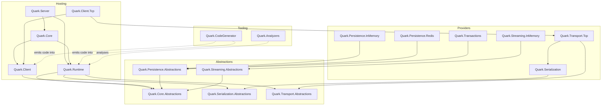
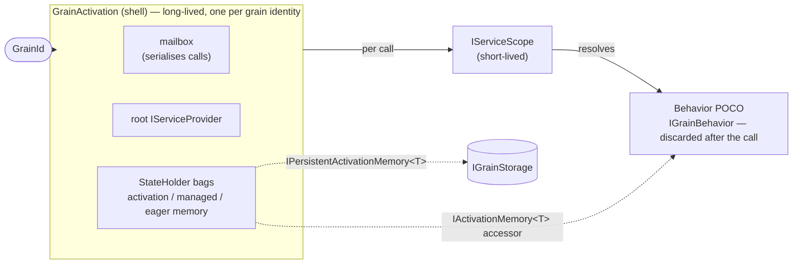
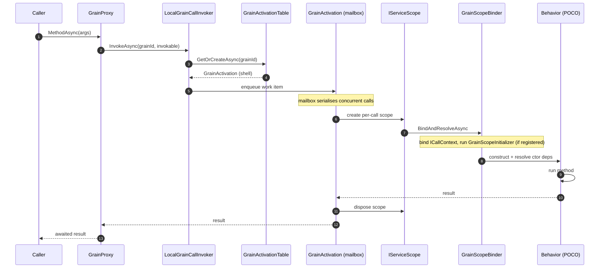
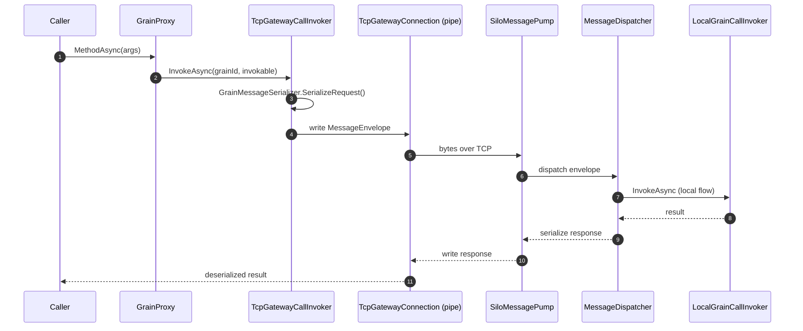
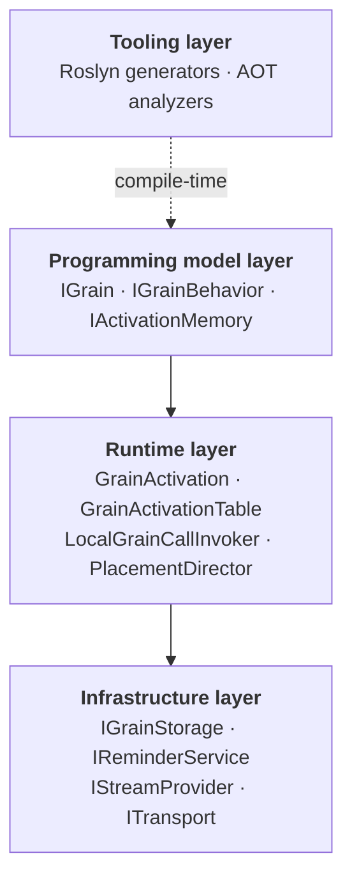

# Architecture

## Package layout

| Package | Role |
|---|---|
| `Quark.Core.Abstractions` | `GrainId`, `GrainType`, `IGrain`, key-typed grain interfaces, `IGrainFactory`, `IClusterClient`, `IGrainContext`, lifecycle, placement attributes |
| `Quark.Serialization.Abstractions` | `IFieldCodec<T>`, `IDeepCopier<T>`, `CodecWriter`/`CodecReader`, `[GenerateSerializer]`/`[Id]`/`[Alias]` |
| `Quark.Transport.Abstractions` | `ITransport`, `ITransportListener`, `ITransportConnection` (IDuplexPipe), `MessageEnvelope` |
| `Quark.Core` | `ISiloBuilder`, `IClientBuilder`, `UseQuark()`/`UseQuarkClient()` host-builder extensions |
| `Quark.Runtime` | Silo-side runtime: `GrainActivation`, `GrainActivationTable`, `LocalGrainCallInvoker`, `SiloHostedService`, message pump/dispatcher, placement |
| `Quark.Client` | `LocalClusterClient`, `LocalGrainFactory`, proxy/observer factory registries |
| `Quark.Client.Tcp` | `TcpGatewayClusterClient`, `TcpGatewayGrainFactory`, client-side stream push |
| `Quark.Serialization` | 18 primitive codecs, `CodecProvider`, `QuarkSerializer`, serialization DI |
| `Quark.Transport.Tcp` | `TcpTransport`/`TcpTransportListener`/`TcpTransportConnection` (System.IO.Pipelines), TLS |
| `Quark.Persistence.Abstractions` | `IGrainStorage`, `IPersistentActivationMemory<T>`, `IStorage<T>`, `GrainState<T>`, `JournaledGrain<TState,TEvent>` |
| `Quark.Persistence.InMemory` | In-memory `IGrainStorage` provider |
| `Quark.Persistence.Redis` | Redis-backed `IGrainStorage` (StackExchange.Redis) |
| `Quark.Reminders.Abstractions` | `IRemindable`, `IReminderService`, `IGrainReminder`, `DefaultReminderService` |
| `Quark.Reminders.InMemory` | In-process reminder store |
| `Quark.Reminders.Redis` | Redis-backed reminder store |
| `Quark.Streaming.Abstractions` | `IAsyncStream<T>`, `IAsyncObserver<T>`, `StreamId`, `[ImplicitStreamSubscription]` |
| `Quark.Streaming.InMemory` | In-memory stream provider |
| `Quark.Transactions` | `ITransactionalState<T>`, `[Transaction]`, 2PC coordinator |
| `Quark.CodeGenerator` | Roslyn incremental generators: `GrainProxyGenerator`, `BehaviorRegistrationGenerator`, `SerializerGenerator` |
| `Quark.Analyzers` | AOT-safety Roslyn analyzers (QRK0001–QRK0003) |
| `Quark.Testing` | `TestCluster`/`TestSilo`/`TestClient` in-process test harness |

## Package dependency graph

How the packages layer on top of each other. Arrows point from a package to what it depends on;
abstractions sit at the bottom, providers and tooling on top.



## Engine model (M2)

Quark's M2 milestone moved from the Orleans **Framework model** (inheriting `Grain`) to the **Engine model** (implementing `IGrainBehavior`).

| | Framework model | Engine model |
|---|---|---|
| Developer writes | `class MyGrain : Grain` | `class MyBehavior : IGrainBehavior` |
| Lifecycle owner | Developer (inherits base class) | Engine (controls scope and scheduling) |
| DI scope | Root — leaks scoped services | Per-call — fresh `IServiceScope` each call |
| In-memory state | Field on the long-lived grain | `IActivationMemory<TState>` — lives in shell |
| Persistent state | `Grain<TState>` base class | `IPersistentActivationMemory<TState>` |
| RAM footprint | Full grain object tree per activation | Lightweight shell; behavior objects exist for milliseconds |
| Startup safety | Fails at first live call | `BehaviorStartupValidator` fails silo at startup |

### Key concepts

**Shell** (`GrainActivation`) — the long-lived object that owns the mailbox (`Channel<Func<Task>>`). It holds the `GrainId`, root `IServiceProvider`, and `StateHolder<TState>` bags for activation memory. One shell per live grain identity on this silo.

**Behavior** — a POCO class implementing `IGrainBehavior`. Constructed per call inside a short-lived `IServiceScope`, executes, then discarded. All constructor parameters are resolved from that scope.

**Activation memory** — a `StateHolder<TState>` owned by the shell. Survives across calls on the same activation; lost on deactivation. Exposed to the behavior via `IActivationMemory<TState>`.

**The core contract:** behavior code is execution logic; the activation shell owns identity,
ordering, state lifetime, timers, disposal, and placement. A behavior instance never outlives the
call that created it, so anything it needs to remember must be handed to the shell — there is no
"the actor" to keep it in, only "the current call." See [Writing Grains](Writing-Grains#the-one-rule-behavior-fields-are-per-call)
for what that means in practice and how it contrasts with long-lived actor-object frameworks.

The shell is the only long-lived object; behaviors are transient. One shell can serve many behavior
instances over its lifetime — one per call:



## Local call flow

A single in-process call, from the client proxy down to the behavior and back. The mailbox is what
serialises concurrent calls to the same activation (unless the method is `[Reentrant]`).



## Remote (TCP gateway) call flow

A call from a silo-less client. The request is serialised, crosses the TCP gateway, and re-enters
the **same local flow** on the silo side. See [Clustering and Transport](Clustering-and-Transport)
for the transport-level detail.



## DI registration pattern

Grains, behaviors, proxies, and transport dispatchers use explicit registration. Nothing is discovered via assembly scanning (trim-unsafe). A typical silo registers:

```csharp
silo.Services.AddGrainBehavior<IMyGrain, MyBehavior>();
silo.Services.AddGrainTransportDispatcher(new GrainType("MyGrain"), new MyGrainProxy_TransportDispatcher());
silo.Services.AddScoped<IActivationMemory<MyState>>(sp =>
    new ActivationMemoryAccessor<MyState>(
        sp.GetRequiredService<IActivationShellAccessor>().Shell.GetOrCreateHolder<MyState>()));
```

The `BehaviorRegistrationGenerator` eliminates this boilerplate — see [Source Generators](Source-Generators).

## Per-call scope initializers (multi-tenant DI scoping)

`GrainScopeInitializer` is a delegate hook that runs inside every freshly-created per-call
`IServiceScope`, right after the shell accessor and `ICallContext` are bound but **before** the
behavior instance (and its scoped constructor dependencies) are resolved:

```csharp
public delegate ValueTask GrainScopeInitializer(
    ICallContext ctx,
    IServiceProvider scopedProvider,
    CancellationToken cancellationToken);
```

`GrainScopeBinder.BindAndResolveAsync` looks the initializer up by `GrainType` in
`IGrainScopeInitializerRegistry` and, if one is registered, awaits it before calling
`IBehaviorResolver.Resolve`. If nothing is registered for the grain type, the lookup and delegate
invocation are skipped entirely — the hook is opt-in per grain type, not a global pipeline step.

This is the extension point behind **multi-tenancy**: derive a tenant from `GrainId.Key` and
populate a scoped tenant-context service that other scoped dependencies (a tenant-scoped
`DbContext`, connection string, cache namespace, ...) read from during construction. Register one
per grain type with `AddGrainScopeInitializer<TInterface, TBehavior>`:

```csharp
silo.Services.AddScoped<TenantContext>();
silo.Services.AddGrainScopeInitializer<IOrderGrain, OrderBehavior>((ctx, sp, ct) =>
{
    // GrainId.Key convention: "{tenantId}/{orderId}"
    sp.GetRequiredService<TenantContext>().TenantId = ctx.GrainId.Key.Split('/')[0];
    return ValueTask.CompletedTask;
});
```

**Where it runs** — once per activation (`GrainActivation.RunActivationAsync`, before
`OnActivateAsync`) and again on every subsequent call (`LocalGrainCallInvoker`, before the behavior
is constructed for that call) — because each of those creates its own fresh `IServiceScope` and the
binder runs on every scope.

**Failure semantics** — an initializer that throws propagates to the caller and faults the
activation; `GrainActivationTable` removes it so the next call attempts a fresh activation rather
than reusing a partially-initialized one. Use this to reject calls for an unknown or unauthorized
tenant before any scoped state, or the behavior itself, is constructed.

Like other `Add*` registrations, this is deferred: `SiloHostedService.StartAsync` applies all
`AddGrainScopeInitializer` calls into the singleton `IGrainScopeInitializerRegistry` before the silo
starts serving calls. See [Writing Grains](Writing-Grains#multi-tenant-scope-initialization) for a
full worked example.

## Layered architecture


