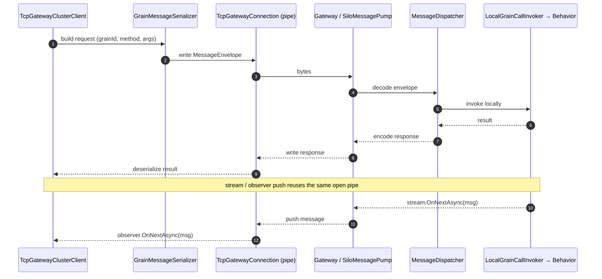

# Clustering and Transport

## Single-silo (localhost)

The simplest setup — one silo, one process, co-hosted client:

```csharp
var host = Host.CreateDefaultBuilder(args)
    .UseQuark(silo =>
    {
        silo.Services.AddQuarkRuntime();
        silo.Services.AddTcpTransport();
        silo.UseLocalhostClustering(siloPort: 11112, gatewayPort: 30002);
        // ... grain registrations
    })
    .UseQuarkClient(client =>
    {
        client.Services.AddLocalClusterClient();
        // ... proxy registrations
    })
    .Build();
```

`UseLocalhostClustering` configures the silo to listen on the given port and exposes a TCP gateway for remote clients.

## Multi-silo clustering

For multi-silo deployments, configure `IMembershipTable` so silos can discover each other. Quark's clustering is based on a membership oracle and a distributed grain directory.

### Membership configuration

```csharp
silo.UseLocalhostClustering(
    siloPort:    11111,
    gatewayPort: 30000,
    primarySiloEndpoint: new IPEndPoint(IPAddress.Loopback, 11111));
```

In production, replace `UseLocalhostClustering` with a provider-specific membership table (Redis, SQL, etc.). The `IMembershipTable` contract is the extension point.

### Grain directory

The distributed `IGrainDirectory` tracks which silo hosts each grain activation. The default implementation is `InMemoryGrainDirectory` (single-silo). For multi-silo scenarios, a distributed directory is required.

### `ILocalSiloDetails`

Inject `ILocalSiloDetails` into any service or behavior to access the current silo's identity:

```csharp
public class DiagnosticsBehavior : IGrainBehavior, IDiagnosticsGrain
{
    private readonly ILocalSiloDetails _siloDetails;

    public DiagnosticsBehavior(ILocalSiloDetails siloDetails)
        => _siloDetails = siloDetails;

    public Task<string> GetSiloNameAsync()
        => Task.FromResult(_siloDetails.Name);
}
```

Available properties:

```csharp
_siloDetails.Name          // configured silo name
_siloDetails.SiloAddress   // SiloAddress (IP + port + generation)
_siloDetails.ClusterId     // cluster identifier string
_siloDetails.ServiceId     // service identifier string
```

## TCP transport

Quark uses `System.IO.Pipelines` for all TCP I/O.

```csharp
silo.Services.AddTcpTransport();
```

### Message flow over the gateway

A remote grain call is a request/response pair over one duplex pipe; the same connection is also used
to **push** stream items and observer callbacks back to the client without polling.



### Transport options

```csharp
silo.Services.Configure<TcpTransportOptions>(opts =>
{
    opts.Port          = 11112;        // silo-to-silo listening port
    opts.GatewayPort   = 30002;        // client-facing gateway port
    opts.BacklogSize   = 128;
});
```

### TLS

Enable TLS by providing a server certificate:

```csharp
silo.Services.Configure<TlsOptions>(opts =>
{
    opts.LocalCertificate = X509Certificate2.CreateFromPemFile("cert.pem", "key.pem");
    opts.RequireClientCertificate = false;  // set true for mutual TLS
    opts.OnAuthenticationOptions = (authOptions, connection) =>
    {
        // Customise SslServerAuthenticationOptions per connection
    };
});
```

Client-side TLS:

```csharp
client.Services.Configure<TlsOptions>(opts =>
{
    opts.RemoteCertificateValidationCallback = (sender, cert, chain, errors) => true; // dev only
    // or provide a client certificate for mutual TLS:
    opts.LocalCertificate = X509Certificate2.CreateFromPemFile("client-cert.pem", "client-key.pem");
});
```

## TCP gateway client (`Quark.Client.Tcp`)

`TcpGatewayClusterClient` is a standalone, remote-only cluster client. Use it in processes that have no silo — standalone console apps, services, mobile backends.

### Client setup

```csharp
.UseQuarkClient(client =>
{
    client.UseLocalhostGateway(30002);                          // connect to silo gateway
    client.AddTcpClientStreams("chat");                         // optional: receive stream pushes
    client.Services.AddStreamableCodec<ChatMsg, ChatMsgCodec>(); // required for stream types
    client.Services.AddGrainProxy<IChannelGrain, ChannelGrainProxy>();
})
```

`UseLocalhostGateway` is a convenience overload for `127.0.0.1`. For a production address:

```csharp
client.UseTcpGateway("10.0.0.50", 30002);
```

### Calling grains from the TCP client

Identical to the in-process API:

```csharp
var clusterClient = host.Services.GetRequiredService<IClusterClient>();
var grain = clusterClient.GetGrain<IChannelGrain>("general");
var streamId = await grain.Join("alice");
```

The call is serialized via `GrainMessageSerializer`, sent over the TCP connection to the silo gateway, dispatched through `MessageDispatcher`, and the response is serialized back.

### Grain reference serialization

When a grain method returns a grain reference (e.g., `Task<IPlayerGrain>`), the generated proxy emits the grain's `GrainId` over the wire. The `GrainProxyGenerator` handles the serialization in the generated `TransportDispatcher` — grain references round-trip correctly between silo and TCP client.

## Placement strategies

The `PlacementDirector` evaluates the placement attribute on a grain's behavior class when a new activation is needed:

| Attribute | Behaviour |
|---|---|
| `[RandomPlacement]` (default) | Activate on any available silo |
| `[PreferLocalPlacement]` | Prefer the silo handling the call |
| `[HashBasedPlacement]` | Deterministic silo via key hash |
| `[LocalPlacement]` | Must activate on the local silo |
| `[StatelessWorker]` | Multiple activations per silo |

For single-silo deployments, all strategies resolve to the local silo.

## Silo-to-silo transport

Multi-silo clusters need a way for one silo to forward grain calls to the silo that owns the activation. Quark implements this via the following additions (all in `Quark.Runtime`).

### Components

| Component | Responsibility |
|---|---|
| `IClusterMembershipSnapshot` | Cheap cached list of currently Active silos; consumed by `PlacementDirector` |
| `DefaultClusterMembershipSnapshot` | Mutable implementation updated by `PeerConnectionManager` via `volatile` swap |
| `NetworkedSiloRouter` | `ISiloRouter` implementation whose invoker map is populated with real TCP invokers |
| `SiloPeerConnection` | Lazy, single-flight TCP connection to a peer silo; mirrors `TcpGatewayConnection` |
| `SiloCallInvoker` | `IGrainCallInvoker` that serializes a grain call, sends it to a peer via `SiloPeerConnection`, and stamps the `x-quark-hop: 1` header |
| `PeerConnectionManager` | `BackgroundService` that polls `IMembershipTable`, registers `SiloCallInvoker` per Active peer into `NetworkedSiloRouter`, and updates `DefaultClusterMembershipSnapshot` |

### Loop guard

Every request forwarded by `SiloCallInvoker` carries `x-quark-hop: 1`. `MessageDispatcher` reads this header: if present it routes the request to the keyed `"silo-terminal"` `LocalGrainCallInvoker` (constructed without a `siloRouter`) so the receiving silo always activates locally and never re-forwards.

### Registration

```csharp
builder.UseQuark(silo =>
{
    silo.Services.AddQuarkRuntime();
    silo.Services.AddSiloToSiloTransport(); // registers NetworkedSiloRouter, PeerConnectionManager, etc.
    silo.Services.AddTcpTransport();
    silo.UseLocalhostClustering(gatewayPort: 30001);
});
```

### Placement with multiple silos

`LocalGrainCallInvoker` consults `PlacementDirector` when both `IClusterMembershipSnapshot` and `ISiloRouter` are registered. If placement selects a remote silo it delegates to that silo's `SiloCallInvoker` and caches the mapping in the local grain directory for subsequent calls.

Non-deterministic strategies (`[RandomPlacement]`, `[PreferLocalPlacement]`, `[StatelessWorker]`) may produce duplicate activations in a multi-silo cluster when grains are first accessed from different silos simultaneously. Only `[HashBasedPlacement]` guarantees single-activation across silos (each silo independently computes the same deterministic owner). A warning is logged once when `ActiveSilos.Count > 1`.

### Non-goals for this release

- Reconnect / exponential backoff — tracked in issue #60
- TLS / mutual auth — tracked in issue #56
- Distributed grain directory — activations are locally registered; no cross-silo lookup
