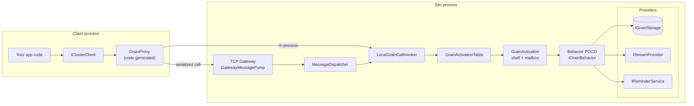

<p align="center">
  
</p>

# Quark

Quark is a **Native AOT-first, Orleans-compatible distributed actor framework** for .NET 10.

It follows the Orleans mental model — Grain, Silo, Client, Placement, Persistence — while being built from the ground up for AOT compilation, per-call DI scoping, and lean memory footprints.

New here? Two pages frame everything else: **[Why Quark](Why-Quark)** (what Quark bets on vs Orleans/Akka.NET, and when not to use it) and **[Lifecycle and Failure Semantics](Lifecycle-and-Failure-Semantics)** (the engine contract — what lives how long and exactly what happens on failure).

## How the pieces fit

A client calls grains through a generated proxy. In-process the proxy talks straight to the local
invoker; remotely it serialises the call across the TCP gateway. On the silo, the activation table
owns one long-lived shell per grain identity, and each call runs a freshly-constructed behavior POCO
that reads and writes its state through the persistence, streaming, and reminder providers.



## API compatibility tiers

| Tier | Meaning |
|---|---|
| **Drop-in** | Same attribute/interface names and signatures as Orleans — no code changes |
| **Minor-change** | Same concept, different DI wiring |
| **Quark-native** | New concepts without direct Orleans equivalents |

## Feature status

| Feature | Status |
|---|---|
| Grain behaviors (engine model) | ✅ |
| Grain interfaces & key types | ✅ |
| Placement strategies | ✅ |
| In-memory grain timers | ✅ |
| Durable grain reminders (in-memory + Redis) | ✅ |
| `[Reentrant]` concurrent dispatch | ✅ |
| `[PersistentState]` injection | ✅ |
| Per-call grain scope initializers (`AddGrainScopeInitializer`, multi-tenant DI scoping) | ✅ |
| `IPersistentActivationMemory<T>` | ✅ |
| `JournaledGrain<TState,TEvent>` event sourcing | ✅ |
| In-memory streams (`IAsyncStream<T>`) | ✅ |
| TCP gateway client (`Quark.Client.Tcp`) | ✅ |
| Client-side stream push over TCP | ✅ |
| Multi-silo clustering | ✅ |
| TLS transport | ✅ |
| `ITransactionalState<T>` + 2PC transactions | ✅ |
| Idle-timeout grain collector | ✅ |
| Grain observers (`IGrainObserver`) | ✅ |
| `AsReference<T>()` / `CreateObjectReference<T>()` | ✅ |
| OpenTelemetry activity propagation | ✅ |
| Native AOT + trim-safe throughout | ✅ |
| `BehaviorRegistrationGenerator` (codegen DI wiring) | ✅ |

## Quick start

### 1. Define a grain interface

```csharp
// In your shared project
public interface ICounterGrain : IGrainWithStringKey
{
    Task IncrementAsync();
    Task<int> GetAsync();
}
```

### 2. Write a grain behavior

```csharp
// In your server project
public sealed class CounterState { public int Count { get; set; } }

public sealed class CounterBehavior : IGrainBehavior, ICounterGrain
{
    private readonly IActivationMemory<CounterState> _memory;

    public CounterBehavior(IActivationMemory<CounterState> memory) => _memory = memory;

    public Task IncrementAsync() { _memory.Value.Count++; return Task.CompletedTask; }
    public Task<int> GetAsync()  => Task.FromResult(_memory.Value.Count);
}
```

### 3. Wire up the host

```csharp
var host = Host.CreateDefaultBuilder(args)
    .UseQuark(silo =>
    {
        silo.Services.AddQuarkRuntime();
        silo.Services.AddTcpTransport();
        silo.UseLocalhostClustering(gatewayPort: 30001);

        silo.Services.AddGrainBehavior<ICounterGrain, CounterBehavior>();
        silo.Services.AddGrainTransportDispatcher(
            new GrainType("CounterGrain"),
            new CounterGrainProxy_TransportDispatcher()); // code-generated

        silo.Services.AddScoped<IActivationMemory<CounterState>>(sp =>
            new ActivationMemoryAccessor<CounterState>(
                sp.GetRequiredService<IActivationShellAccessor>()
                  .Shell.GetOrCreateHolder<CounterState>()));
    })
    .UseQuarkClient(client =>
    {
        client.Services.AddLocalClusterClient();
        client.Services.AddGrainProxy<ICounterGrain, CounterGrainProxy>(); // code-generated
    })
    .Build();
```

### 4. Call a grain

```csharp
var factory = host.Services.GetRequiredService<IGrainFactory>();
var counter = factory.GetGrain<ICounterGrain>("my-counter");
await counter.IncrementAsync();
Console.WriteLine(await counter.GetAsync()); // 1
```

## Build commands

```bash
dotnet build Quark.slnx
dotnet test Quark.slnx
dotnet publish src/Quark.Runtime/Quark.Runtime.csproj -f net10.0 -c Release -r linux-x64 /p:PublishAot=true
```

.NET SDK is pinned to `10.0.201` via `global.json`. Package versions are centrally managed in `Directory.Packages.props`.

## Pages

- [Why Quark](Why-Quark)
- [Architecture](Architecture)
- [Lifecycle and Failure Semantics](Lifecycle-and-Failure-Semantics)
- [Writing Grains](Writing-Grains)
- [Persistence](Persistence)
- [Serialization](Serialization)
- [Streaming](Streaming)
- [Timers and Reminders](Timers-and-Reminders)
- [Transactions](Transactions)
- [Clustering and Transport](Clustering-and-Transport)
- [Source Generators](Source-Generators)
- [Testing](Testing)
- [AOT and Trim](AOT-and-Trim)
- [Samples](Samples)
- [Orleans Migration Guide](Orleans-Migration)
