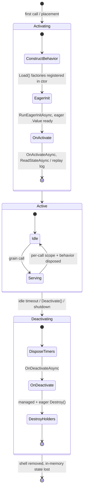
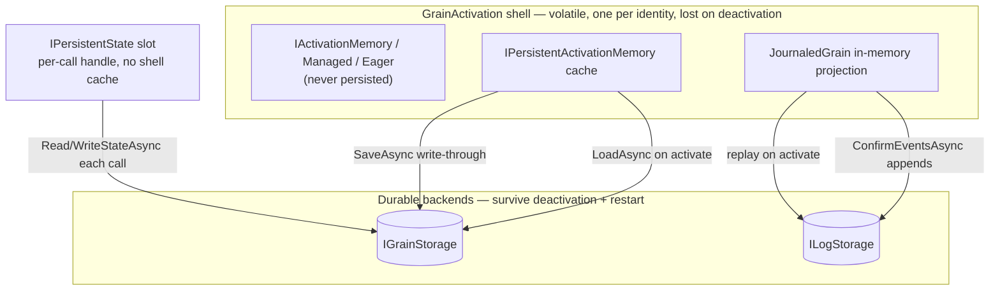
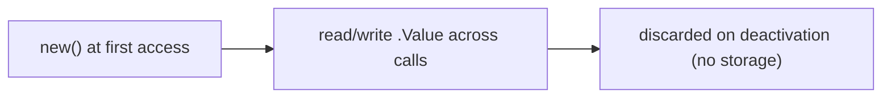
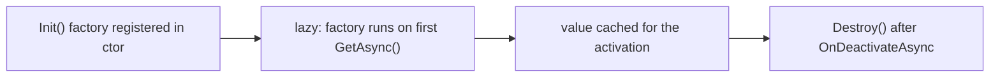
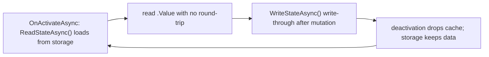
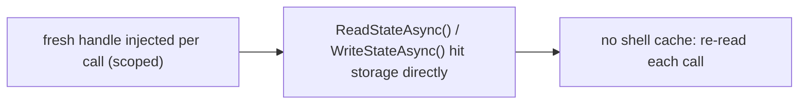
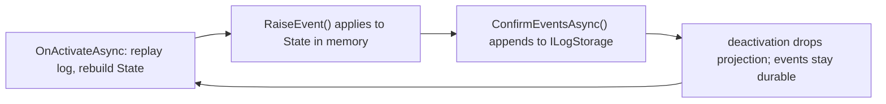
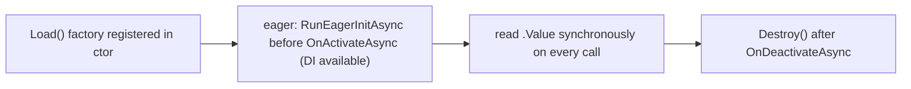

# Persistence

Quark offers six implemented persistence patterns, from ephemeral in-memory state to full event sourcing.

**Which one do I use?** Answer three questions:

1. **Must it survive deactivation / restart?** No → `IActivationMemory<T>` (plain data), `IManagedActivationMemory<T>` (needs async init or cleanup — buffers, clients, handles), or `IEagerActivationMemory<T>` (must be ready before `OnActivateAsync`). Yes → continue.
2. **Do you need the history or just the latest value?** History → `JournaledGrain<TState,TEvent>`. Latest value → continue.
3. **Hot state or Orleans compatibility?** Read on most calls → `IPersistentActivationMemory<T>` (shell-cached, explicit `WriteStateAsync`). Migrating Orleans code or need multiple named slots → `[PersistentState] IPersistentState<T>` (⚠ re-reads storage every call — see the comparison below).

Multi-grain atomic updates are a separate concern — see [Transactions](Transactions). What each pattern guarantees on failure and deactivation is specified in [Lifecycle and Failure Semantics](Lifecycle-and-Failure-Semantics).

| Pattern | Interface | Init timing | `.Value` access | Storage |
|---|---|---|---|---|
| In-memory | `IActivationMemory<T>` | `new()` sync | Sync | None |
| Managed in-memory | `IManagedActivationMemory<T>` | Lazy — first `GetAsync()` | `await GetAsync()` | None |
| Eager in-memory | `IEagerActivationMemory<T>` | Eager — before `OnActivateAsync` | Sync | None |
| Persistent activation | `IPersistentActivationMemory<T>` | `ReadStateAsync()` | Sync | `IGrainStorage` |
| Named state injection | `[PersistentState] IPersistentState<T>` | `ReadStateAsync()` | `.State` | Named `IGrainStorage` |
| Event sourcing | `JournaledGrain<TState,TEvent>` | Replay on activation | `State` | `ILogStorage` |

## Lifecycle at a glance

Every persistence pattern is anchored to the **grain activation lifecycle**. State init runs during
activation; cleanup runs during deactivation, in this exact order (verified against the runtime —
`GrainActivation.RunActivationAsync` / `RunDeactivationAsync`):



**What survives, and where the source of truth lives.** Activation memory (plain, managed, eager) and
the journaled projection live only in the volatile shell; durable backends are the only thing that
crosses a deactivation or a silo restart:



| Pattern | Survives across calls? | Survives deactivation? | Source of truth |
|---|---|---|---|
| `IActivationMemory<T>` | ✅ shell-cached | ❌ | shell |
| `IManagedActivationMemory<T>` | ✅ shell-cached | ❌ | shell |
| `IEagerActivationMemory<T>` | ✅ shell-cached | ❌ (rebuilt each activation) | shell (rebuilt from DI) |
| `IPersistentActivationMemory<T>` | ✅ shell-cached | ✅ via `SaveAsync` | `IGrainStorage` |
| `[PersistentState] IPersistentState<T>` | ⚠️ **no** — re-read each call | ✅ | `IGrainStorage` |
| `JournaledGrain<TState,TEvent>` | ✅ shell projection | ✅ via event log | `ILogStorage` |

The per-pattern lifecycle is shown inline in each section below.

## 1. In-memory activation state (`IActivationMemory<T>`)

For state that must survive across method calls on the same activation but does **not** need to outlive it:



```csharp
public sealed class CounterState { public int Count { get; set; } }

public sealed class CounterBehavior : IGrainBehavior, ICounterGrain
{
    private readonly IActivationMemory<CounterState> _memory;

    public CounterBehavior(IActivationMemory<CounterState> memory)
        => _memory = memory;

    public Task IncrementAsync() { _memory.Value.Count++; return Task.CompletedTask; }
    public Task<int> GetAsync()  => Task.FromResult(_memory.Value.Count);
}
```

Register in silo startup:

```csharp
silo.Services.AddScoped<IActivationMemory<CounterState>>(sp =>
    new ActivationMemoryAccessor<CounterState>(
        sp.GetRequiredService<IActivationShellAccessor>()
          .Shell.GetOrCreateHolder<CounterState>()));
```

The `StateHolder<TState>` lives on the `GrainActivation` shell and is shared across all per-call scopes for the same activation.

## 2. Managed in-memory resource (`IManagedActivationMemory<T>`)

For resources that require **async initialization** and optional **async cleanup** on deactivation, but must not be persisted. Common uses: in-memory ring buffers, pooled channels, cached projections, or anything built with an async factory.



Key differences from `IActivationMemory<T>`:

- `T` has no `new()` constraint — works with any class.
- Init is async and **lazy**: the factory runs only on the first `GetAsync()` call, not at activation time.
- Access is always `await GetAsync()` — one async hop per call site.

Key differences from `IEagerActivationMemory<T>` _(see section 6)_:

- **Lazy vs. eager**: factory runs on first access, not during grain activation.
- **Async vs. sync access**: `await GetAsync()` instead of `.Value`.
- The factory receives no `IServiceProvider`; close over injected services in the behavior constructor instead.

```csharp
public sealed class MetricsBehavior : IGrainBehavior, IMetricsGrain
{
    private readonly IManagedActivationMemory<RingBuffer> _buffer;

    public MetricsBehavior(IManagedActivationMemory<RingBuffer> buffer, IOptions<MetricsOptions> opts)
    {
        _buffer = buffer
            .Init(() => ValueTask.FromResult(new RingBuffer(capacity: opts.Value.BufferSize)))
            .Destroy(b => b.FlushAsync());
    }

    public async Task RecordAsync(double value)
    {
        RingBuffer buf = await _buffer.GetAsync();
        buf.Write(value);
    }
}
```

**API:**

| Member | Description |
|---|---|
| `Init(Func<ValueTask<T>>)` | Configures the async factory. Called once in the behavior constructor. Invoked on the first `GetAsync()` call; result cached for the activation lifetime. |
| `Destroy(Func<T, ValueTask>)` | Optional cleanup delegate. Called after `OnDeactivateAsync` completes, so the grain can still read the resource during teardown. Omit if no cleanup is needed. |
| `GetAsync(CancellationToken)` | Returns the value; initializes it on first call. |
| `IsInitialized` | `true` once the factory has succeeded. `Destroy` is a no-op if the resource was never initialized. |

> **Thread safety:** `GetAsync()` is safe only from within the grain mailbox. Do not call from timer callbacks or external threads without routing through `GrainActivation.PostAsync`.

Register in silo startup:

```csharp
// Manual:
silo.Services.AddManagedActivationMemory<RingBuffer>();

// Via BehaviorRegistrationGenerator (emitted automatically when the behavior
// has an IManagedActivationMemory<T> constructor parameter):
silo.Services.AddMyAssemblyBehaviors();
```

## 3. Persistent activation state (`IPersistentActivationMemory<T>`)

Drop-in for `IActivationMemory<T>` with automatic load-on-first-access and explicit `WriteAsync()`:



```csharp
public sealed class AccountBehavior : IGrainBehavior, IAccountGrain, IActivationLifecycle
{
    private readonly IPersistentActivationMemory<AccountState> _state;

    public AccountBehavior(IPersistentActivationMemory<AccountState> state)
        => _state = state;

    public async Task OnActivateAsync(CancellationToken ct)
        => await _state.ReadStateAsync(ct);

    public async Task DepositAsync(decimal amount)
    {
        _state.Value.Balance += amount;
        await _state.WriteStateAsync();
    }

    public Task<decimal> GetBalanceAsync()
        => Task.FromResult(_state.Value.Balance);
}
```

Register in silo startup (replace `InMemory` with `Redis` for durable storage):

```csharp
silo.Services.AddInMemoryGrainStorage();

silo.Services.AddScoped<IPersistentActivationMemory<AccountState>>(sp =>
    new PersistentActivationMemoryAccessor<AccountState>(
        sp.GetRequiredService<IActivationShellAccessor>().Shell.GetOrCreateHolder<AccountState>(),
        sp.GetRequiredService<IGrainStorage>(),
        sp.GetRequiredService<IActivationShellAccessor>().Shell.GrainId,
        "accounts")); // storage provider name
```

## 4. `[PersistentState]` attribute injection (Orleans-compatible)

Grains that want Orleans-style named state injection use `IPersistentState<T>` with the `[PersistentState]` attribute:

> ⚠️ **Lifetime gotcha.** Unlike `IPersistentActivationMemory<T>`, a named slot is **not** cached in
> the shell. The handle is resolved **per call** (scoped), so its in-memory `State`/`RecordExists`
> reset between calls. Reading state in `OnActivateAsync` only populates the first call's instance.
> Treat it as a thin handle over a storage record: `ReadStateAsync()` when you need the value,
> `WriteStateAsync()` after a mutation.



```csharp
public sealed class ProfileBehavior : IGrainBehavior, IProfileGrain
{
    private readonly IPersistentState<ProfileData> _profile;

    public ProfileBehavior(
        [PersistentState("profile", "profileStore")] IPersistentState<ProfileData> profile)
    {
        _profile = profile;
    }

    public async Task UpdateNameAsync(string name)
    {
        _profile.State.Name = name;
        await _profile.WriteStateAsync();
    }
}
```

Register the named storage provider:

```csharp
services.AddInMemoryGrainStorage("profileStore");
// or
services.AddRedisGrainStorage("profileStore", opt => opt.ConnectionString = "localhost:6379");
```

The `[PersistentState("name","provider")]` attribute is resolved at construction time — no reflection at call time.

## 5. Event sourcing (`JournaledGrain<TState, TEvent>`)

For grains whose history of decisions matters. Inherit from `JournaledGrain<TState,TEvent>`:



```csharp
public sealed class BankAccountState { public decimal Balance { get; set; } }
public abstract record AccountEvent;
public record Deposited(decimal Amount) : AccountEvent;
public record Withdrawn(decimal Amount) : AccountEvent;

public sealed class BankAccountBehavior
    : JournaledGrain<BankAccountState, AccountEvent>, IBankAccountGrain
{
    public BankAccountBehavior(
        IActivationMemory<JournaledGrainState<BankAccountState, AccountEvent>> memory,
        ICallContext ctx,
        ILogStorage logStorage)
        : base(memory, ctx, logStorage) { }

    protected override void TransitionState(BankAccountState state, AccountEvent @event)
    {
        switch (@event)
        {
            case Deposited(var amount):  state.Balance += amount; break;
            case Withdrawn(var amount):  state.Balance -= amount; break;
        }
    }

    public async Task DepositAsync(decimal amount)
    {
        RaiseEvent(new Deposited(amount));
        await ConfirmEventsAsync();
    }

    public Task<decimal> GetBalanceAsync() => Task.FromResult(State.Balance);
}
```

Key members:
- `RaiseEvent(event)` — applies the event to `State` immediately; stages it for persistence
- `ConfirmEventsAsync()` — persists all staged events to `ILogStorage`
- `RetrieveConfirmedEvents(from, to)` — reads events back from storage
- `Version` — number of confirmed events
- `OnActivateAsync` — automatically replays the event log on first activation

Register an `ILogStorage` provider (in-memory is provided):

```csharp
services.AddInMemoryLogStorage();
```

## 6. Eager in-memory resource (`IEagerActivationMemory<T>`)

Fills the gap between `IActivationMemory<T>` (sync default-construct, no DI) and `IManagedActivationMemory<T>` (lazy, async access). Use when you need to **load a large or externally-sourced resource at grain activation time** and then access it **synchronously** on every call.



Motivating use case: a time-series grain that loads a large `RingBuffer<DataPoint>` from a database when it activates. The buffer is too large to persist on every write, but must be fully populated before any method runs and must be readable without `await`.

Key differences from `IManagedActivationMemory<T>`:

- **Eager vs. lazy**: factory runs before `OnActivateAsync` fires, not on first access.
- **Sync access**: `.Value` is available without `await` after activation.
- **Full DI access**: the factory receives the scoped `IServiceProvider`, so repositories, options, and `ICallContext` are all available.

### API

```csharp
public interface IEagerActivationMemory<T> where T : class
{
    // Configure in the behavior constructor. The IServiceProvider is the
    // activation-scoped provider — resolve repositories or ICallContext from it.
    IEagerActivationMemory<T> Load(Func<IServiceProvider, CancellationToken, ValueTask<T>> factory);

    // Optional cleanup called after OnDeactivateAsync, same as IManagedActivationMemory<T>.
    IEagerActivationMemory<T> Destroy(Func<T, ValueTask> cleanup);

    // Synchronous access — safe after grain activation completes.
    T Value { get; }
    bool IsInitialized { get; }
}
```

### Usage

```csharp
public sealed class TimeSeriesBehavior : IGrainBehavior, ITimeSeriesGrain
{
    private readonly IEagerActivationMemory<RingBuffer<DataPoint>> _buffer;

    public TimeSeriesBehavior(IEagerActivationMemory<RingBuffer<DataPoint>> buffer)
    {
        _buffer = buffer
            .Load(async (sp, ct) =>
            {
                var repo = sp.GetRequiredService<ITimeSeriesRepository>();
                var key = sp.GetRequiredService<ICallContext>().GrainId.Key;
                return await repo.LoadRingBufferAsync(key, capacity: 4096, ct);
            })
            .Destroy(b => b.FlushAsync());
    }

    // .Value is always safe — init ran before the first call arrived
    public Task<DataPoint[]> QueryAsync(DateTimeOffset from, DateTimeOffset to)
        => Task.FromResult(_buffer.Value.Query(from, to));
}
```

### How it works in the runtime

When `LocalGrainCallInvoker` creates a new `GrainActivation` it:

1. Constructs the behavior (behavior constructor fires → `Load(...)` registers the factory on the shell's `EagerActivationMemoryHolder<T>`).
2. Calls `RunEagerInitAsync(scopedServiceProvider, ct)` — discovers all `IEagerActivationMemoryHolder` instances in the memory bag and calls each factory.
3. Calls `OnActivateAsync` (if the behavior implements `IActivationLifecycle`).

After step 2 `.Value` is available for the rest of the activation lifetime, including inside `OnActivateAsync`. Accessing `.Value` before initialization (or when `Load` was never called) throws `InvalidOperationException`.

### Registration

```csharp
// Manual:
silo.Services.AddEagerActivationMemory<RingBuffer<DataPoint>>();

// Via BehaviorRegistrationGenerator (auto-detected from constructor parameters):
silo.Services.AddMyAssemblyBehaviors();
```

## Storage providers

### In-memory

```csharp
services.AddInMemoryGrainStorage();               // default provider
services.AddInMemoryGrainStorage("myProvider");   // named provider
```

### Redis

```csharp
services.AddRedisGrainStorage(options =>
{
    options.ConnectionString = "localhost:6379";
});

services.AddRedisGrainStorage("myProvider", options =>
{
    options.ConnectionString = "redis.internal:6379";
    options.KeyPrefix = "quark:";
});
```

State is serialized to JSON via `System.Text.Json` and stored as a Redis string under key `{prefix}{grainType}/{grainId}/{stateName}`.

## Idle-timeout deactivation

Grains that haven't received a call within the configured idle period are deactivated by `GrainIdleCollector`. Configure via `SiloRuntimeOptions`:

```csharp
silo.Services.Configure<SiloRuntimeOptions>(opts =>
{
    opts.CollectionAge = TimeSpan.FromMinutes(5);
    opts.CollectionInterval = TimeSpan.FromMinutes(1);
});
```

To prevent deactivation of a specific grain, call `DelayDeactivation(TimeSpan)` from inside the behavior:

```csharp
_ctx.DelayDeactivation(TimeSpan.FromHours(1));
```
