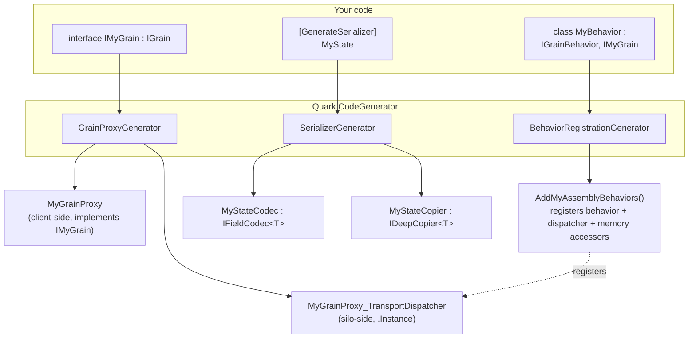
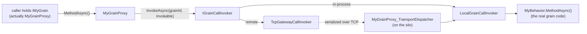

# Source Generators

`Quark.CodeGenerator` ships three Roslyn incremental generators. All generated code is AOT-safe — no reflection, no `MakeGenericType`, no runtime type lookups on hot paths.

## What each generator emits

Three inputs you write — a grain **interface**, a **behavior** class, and `[GenerateSerializer]`
**state/DTO** types — drive three generators. Each input fans out to the artifacts the client and
silo consume at runtime.



## Grain ↔ proxy relationship at runtime

The **proxy** (client) and the **transport dispatcher** (silo) are two halves of the same call. The
proxy implements the grain interface and forwards each method as an *invokable* through an
`IGrainCallInvoker`; over TCP the dispatcher reverses the serialization and re-invokes the real
behavior locally.



Both invokers reach the same `MyBehavior` — the proxy hides whether the grain is local or across the
network. The pairing is by **grain type**: `AddGrainProxy<IMyGrain, MyGrainProxy>()` on the client and
`AddGrainTransportDispatcher(new GrainType("MyGrain"), MyGrainProxy_TransportDispatcher.Instance)` on
the silo (both emitted into the generated registration methods).

## GrainProxyGenerator

For every `interface` that inherits `IGrain`, emits a `{InterfaceName[1..]}Proxy` class that:

- Implements the interface
- Holds a `GrainId` and an `IGrainCallInvoker`
- Routes each method call through `IGrainCallInvoker.InvokeAsync`
- Emits a companion `{InterfaceName[1..]}Proxy_TransportDispatcher` for TCP serialization/deserialization

### Input

```csharp
public interface ICounterGrain : IGrainWithStringKey
{
    Task IncrementAsync();
    Task<int> GetAsync();
}
```

### Generated output (simplified)

```csharp
// CounterGrainProxy.g.cs
public sealed class CounterGrainProxy : ICounterGrain
{
    private readonly GrainId _grainId;
    private readonly IGrainCallInvoker _invoker;

    public CounterGrainProxy(GrainId grainId, IGrainCallInvoker invoker)
    {
        _grainId = grainId;
        _invoker = invoker;
    }

    public Task IncrementAsync()
        => _invoker.InvokeAsync(_grainId, new IncrementInvokable());

    public Task<int> GetAsync()
        => _invoker.InvokeAsync<int>(_grainId, new GetInvokable());
}

// CounterGrainProxy_TransportDispatcher.g.cs
public sealed class CounterGrainProxy_TransportDispatcher : IGrainTransportDispatcher
{
    public static readonly CounterGrainProxy_TransportDispatcher Instance = new();
    // Handles serialize/deserialize for each method over TCP
}
```

### Usage

The proxy is registered on the client side:

```csharp
client.Services.AddGrainProxy<ICounterGrain, CounterGrainProxy>();
```

The transport dispatcher is registered on the silo side:

```csharp
silo.Services.AddGrainTransportDispatcher(
    new GrainType("CounterGrain"),
    CounterGrainProxy_TransportDispatcher.Instance);
```

## BehaviorRegistrationGenerator

Generates a single `QuarkRegistrations.g.cs` per assembly, containing one `AddMyAssemblyBehaviors()` extension method that registers every behavior, transport dispatcher, and activation memory accessor found in that assembly.

### Input — a behavior class

```csharp
public sealed class CounterBehavior : IGrainBehavior, ICounterGrain
{
    public CounterBehavior(IActivationMemory<CounterState> memory) { ... }
}
```

### Generated output (simplified)

```csharp
// QuarkRegistrations.g.cs
public static class QuarkRegistrations
{
    public static IServiceCollection AddMyAssemblyBehaviors(this IServiceCollection services)
    {
        services.AddGrainBehavior<ICounterGrain, CounterBehavior>();
        services.AddGrainTransportDispatcher(
            new GrainType("CounterGrain"),
            CounterGrainProxy_TransportDispatcher.Instance);
        services.AddScoped<IActivationMemory<CounterState>>(sp =>
            new ActivationMemoryAccessor<CounterState>(
                sp.GetRequiredService<IActivationShellAccessor>()
                  .Shell.GetOrCreateHolder<CounterState>()));
        return services;
    }
}
```

### Usage

```csharp
// Replaces all per-grain manual registrations:
silo.Services.AddMyAssemblyBehaviors();
```

### Trigger conditions

The generator emits a `BehaviorModel` for any class that:
1. Is not `abstract` or generic
2. Has at least one `public` or `internal` constructor
3. Implements `IGrainBehavior` (directly or transitively)

### Diagnostics

| Code | Meaning |
|---|---|
| `QRK0050` | Behavior class does not implement any `IGrain`-derived interface |
| `QRK0051` | Behavior class implements multiple `IGrain`-derived interfaces — ambiguous; add `[GrainBehavior("typeName")]` |
| `QRK0052` | Two behaviors use `IPersistentState<T>` on the same `T` with conflicting (stateName, providerName) combinations |
| `QRK0053` | Behavior carries `[ImplicitStreamSubscription]` but the assembly does not reference `Quark.Streaming.InMemory` — auto-registration is skipped (warning) |

### State type detection

The generator scans all constructor parameters and emits scoped registrations automatically for:

| Parameter type | Emitted registration |
|---|---|
| `IActivationMemory<T>` | `ActivationMemoryAccessor<T>` backed by shell holder |
| `IPersistentActivationMemory<T>` | `PersistentActivationMemoryAccessor<T>` backed by `IStorage<T>` |
| `IManagedActivationMemory<T>` | `ManagedActivationMemoryAccessor<T>` backed by managed shell holder |
| `IEagerActivationMemory<T>` | `AddEagerActivationMemory<T>()` (eager shell holder + accessor) |

For `IManagedActivationMemory<T>`, the generated registration is:

```csharp
services.AddScoped<IManagedActivationMemory<RingBuffer>>(static sp =>
    new ManagedActivationMemoryAccessor<RingBuffer>(
        sp.GetRequiredService<IActivationShellAccessor>()
          .Shell.GetOrCreateManagedHolder<RingBuffer>()));
```

All memory types are deduplicated across behaviors — if two behaviors in the same assembly share the same state type, only one registration is emitted.

### Implicit stream subscriptions

For every `[ImplicitStreamSubscription("ns")]` on a behavior, the generator also emits the
matching subscription registration into `AddMyAssemblyBehaviors()`:

```csharp
// behavior: [ImplicitStreamSubscription("chat")] sealed class RoomGrainBehavior ...
services.AddImplicitStreamSubscription("chat", "RoomGrain");
```

The grain-type key honors `[GrainBehavior("key")]`; multiple `[ImplicitStreamSubscription]`
attributes on one behavior each emit a line. Emission is **guarded**: if the assembly does not
reference `Quark.Streaming.InMemory` (so `AddImplicitStreamSubscription` is unresolvable), the
generator skips emission and reports **QRK0053** instead of emitting code that would not compile.
Add a `Quark.Streaming.InMemory` reference to silence the warning and enable auto-wiring.

## SerializerGenerator

For every type annotated `[GenerateSerializer]`, emits an `IFieldCodec<T>` and `IDeepCopier<T>` implementation.

### Input

```csharp
[GenerateSerializer]
public sealed class ChatMsg
{
    [Id(0)] public string Author  { get; set; } = "";
    [Id(1)] public string Text    { get; set; } = "";
    [Id(2)] public DateTimeOffset Created { get; set; }
}
```

### Generated output (simplified)

```csharp
// ChatMsgCodec.g.cs
[RegisterSerializer]
public sealed class ChatMsgCodec : IFieldCodec<ChatMsg>
{
    // Emits/reads each [Id]-tagged field using the registered primitive codecs
    // No reflection — all field access is direct property get/set
}

// ChatMsgCopier.g.cs
[RegisterCopier]
public sealed class ChatMsgCopier : IDeepCopier<ChatMsg>
{
    public ChatMsg DeepCopy(ChatMsg original, CopyContext context)
        => new ChatMsg
        {
            Author  = original.Author,
            Text    = original.Text,
            Created = original.Created,
        };
}
```

### Rules

- `[Id(uint)]` values must be unique within a type and stable across versions.
- Never reuse or renumber an `[Id]` — removed fields should be tombstoned with a comment, not renumbered.
- Adding new fields with new ids is forwards-compatible (old readers skip unknown ids).
- `[Alias("name")]` provides a stable string alias for polymorphic type resolution.

## Enabling the generators

Add a reference to `Quark.CodeGenerator` in your project file:

```xml
<ItemGroup>
  <ProjectReference Include="..\..\src\Quark.CodeGenerator\Quark.CodeGenerator.csproj"
                    OutputItemType="Analyzer"
                    ReferenceOutputAssembly="false" />
</ItemGroup>
```

In NuGet-based setups, reference the `Quark.CodeGenerator` package. The generators run automatically as part of `dotnet build`.
