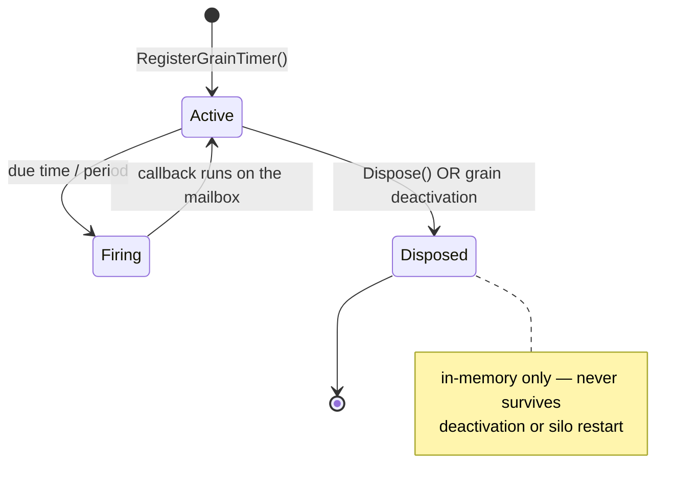
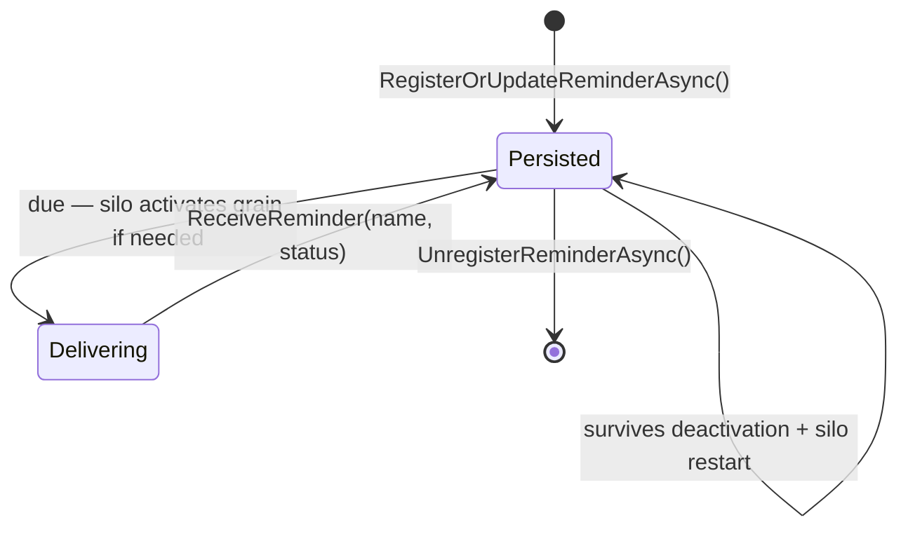

# Timers and Reminders

Quark provides two time-based mechanisms for grains:

| | Grain Timer | Grain Reminder |
|---|---|---|
| Persistence | In-memory, lost on silo restart | Durable, survives restarts |
| Precision | Millisecond | Seconds–minutes |
| Use case | Periodic polling, caching, retry | Scheduled business logic |

## Grain timers

Timers fire in-process and post their callbacks through the grain's mailbox, preserving single-threaded semantics.

### Timer lifetime

A timer is bound to the activation that created it. It is disposed automatically when the grain
deactivates (timers are torn down **first** in `RunDeactivationAsync`, before `OnDeactivateAsync`),
and never survives a silo restart.



### Registration

Inject `IGrainContext` (or use `ICallContext` to get the grain ID and register through the activation shell) and call `RegisterGrainTimer`:

> **Timer handles must be stored in `IActivationMemory<T>`, not in behavior instance fields.**
> Quark creates a fresh behavior instance for every grain method call, including lifecycle hooks
> such as `OnActivateAsync` and `OnDeactivateAsync`. A handle stored in a plain instance field
> during `OnActivateAsync` will always be `null` by the time `OnDeactivateAsync` runs.
> The compiler diagnostic **QRK0020** flags this mistake at build time.

```csharp
public sealed class CacheState
{
    public IGrainTimer? RefreshTimer { get; set; }
    // ... other activation-scoped state
}

public sealed class CacheBehavior : IGrainBehavior, ICacheGrain, IActivationLifecycle
{
    private readonly IActivationMemory<CacheState> _memory;
    private readonly IGrainContext _ctx;

    public CacheBehavior(IActivationMemory<CacheState> memory, IGrainContext ctx)
    {
        _memory = memory;
        _ctx = ctx;
    }

    public Task OnActivateAsync(CancellationToken ct)
    {
        _memory.Value.RefreshTimer = _ctx.RegisterGrainTimer<object?>(
            static (_, _) => Task.CompletedTask, // callback
            null,                                 // state
            new GrainTimerCreationOptions
            {
                DueTime  = TimeSpan.FromSeconds(5),
                Period   = TimeSpan.FromSeconds(30),
                Interleave = false
            });
        return Task.CompletedTask;
    }

    public Task OnDeactivateAsync(DeactivationReason reason, CancellationToken ct)
    {
        _memory.Value.RefreshTimer?.Dispose();
        _memory.Value.RefreshTimer = null;
        return Task.CompletedTask;
    }
}
```

The timer is automatically disposed when the activation is deactivated, but calling `Dispose()` manually cancels it earlier.

### Options

```csharp
new GrainTimerCreationOptions
{
    DueTime    = TimeSpan.Zero,             // delay before first fire
    Period     = TimeSpan.FromSeconds(10),  // interval; Timeout.InfiniteTimeSpan = one-shot
    Interleave = false                      // true = overlapping fires allowed
}
```

When `Interleave = false` (default), a timer tick that arrives while the previous callback is still running is silently dropped. This prevents unbounded queue growth for slow callbacks.

### Changing a running timer

```csharp
_memory.Value.RefreshTimer?.Change(
    dueTime: TimeSpan.FromSeconds(1),
    period:  TimeSpan.FromSeconds(60));
```

### Diagnostics

After each timer callback completes — successfully or with an error — the runtime fires
`IQuarkDiagnosticListener.OnTimerFired(in TimerFiredEvent)`. The event carries the `GrainId`, the
callback `Elapsed` time, and the `Exception` (null on success; `IsSuccess` is the convenience flag).
Register a listener to surface slow or failing timers:

```csharp
services.AddQuarkDiagnostics<MyListener>();

// in MyListener : IQuarkDiagnosticListener
public void OnTimerFired(in TimerFiredEvent e)
{
    if (!e.IsSuccess)
        _log.LogWarning(e.Exception, "Timer on {GrainId} threw after {Elapsed}", e.GrainId, e.Elapsed);
}
```

## Grain reminders

Reminders are durable — they survive silo restarts and are stored in a backing store (in-memory or Redis). When a silo starts, it reloads all reminders for grains it owns and resumes firing them.

### Reminder lifetime

Unlike a timer, a reminder's lifetime is independent of any activation. It lives in the reminder
store until explicitly unregistered, and re-activates a grain to deliver `ReceiveReminder` even if the
grain was idle.



### Prerequisites

1. Implement `IRemindable` on your behavior
2. Register a reminder storage provider

```csharp
// In-memory (single-silo / test scenarios)
services.AddInMemoryReminderService();

// Redis (production, multi-silo)
services.AddRedisReminderService(opts =>
{
    opts.ConnectionString = "localhost:6379";
    opts.KeyPrefix = "quark:reminders:";
    opts.PollInterval = TimeSpan.FromSeconds(1);
});
```

### Writing a remindable grain

```csharp
public sealed class SubscriptionBehavior
    : IGrainBehavior, ISubscriptionGrain, IRemindable, IActivationLifecycle
{
    private readonly IGrainContext _ctx;
    private readonly IActivationMemory<SubscriptionState> _memory;

    public SubscriptionBehavior(IGrainContext ctx, IActivationMemory<SubscriptionState> memory)
    {
        _ctx = ctx;
        _memory = memory;
    }

    public async Task StartRenewalReminder()
    {
        // Register a reminder to fire every day
        await _ctx.ReminderService.RegisterOrUpdateReminderAsync(
            _ctx.GrainId,
            reminderName: "renewal",
            dueTime:       TimeSpan.FromDays(1),
            period:        TimeSpan.FromDays(1));
    }

    public async Task StopRenewalReminder()
    {
        await _ctx.ReminderService.UnregisterReminderAsync(_ctx.GrainId, "renewal");
    }

    // Called by the runtime each time the reminder fires
    public Task ReceiveReminder(string reminderName, TickStatus status)
    {
        if (reminderName == "renewal")
            return ProcessRenewalAsync();
        return Task.CompletedTask;
    }

    private Task ProcessRenewalAsync() { /* ... */ return Task.CompletedTask; }
}
```

### `TickStatus`

```csharp
status.CurrentTickTime   // when this tick fired
status.FirstTickTime     // when the reminder was first registered
status.Period            // configured period
```

### Listing active reminders

```csharp
var reminders = await _ctx.ReminderService.GetRemindersAsync(_ctx.GrainId);
foreach (var r in reminders)
    Console.WriteLine($"{r.ReminderName} ({(r.IsValid ? "active" : "cancelled")})");
```

### Minimum period

The minimum reliable reminder period is determined by the `PollInterval` (default 1 second). Reminders with periods shorter than `PollInterval` fire at the poll cadence, not the requested cadence.
